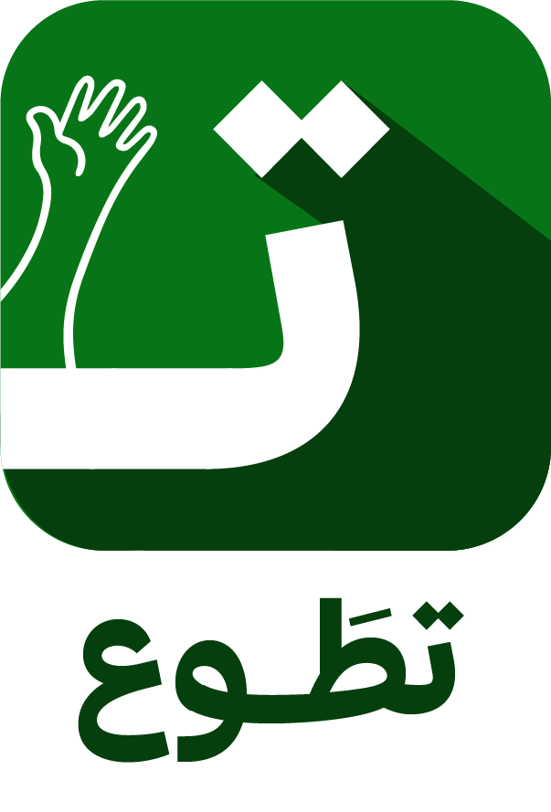

# منصة تطوّع | TAWTOU3 🇩🇿
### المنصة الوطنية الجزائرية للعمل التطوعي، التكوين، وبناء الأثر المجتمعي

<p align="center">
  
</p>

<p align="center">
  <strong>بوابة رقمية تفاعلية متكاملة تربط المتطوعين بالجمعيات والمؤسسات في كافة الـ 58 ولاية جزائرية، مع نظام تلعيب ونقاط، أكاديمية تدريب مجانية، وإصدار شهادات معتمدة.</strong>
</p>

<p align="center">
  
  
  
  
  
  
</p>

---

## 🌟 نظرة عامة (Overview)

**تطوّع (TAWTOU3)** هو نموذج أولي متكامل عالي الدقة (Interactive High-Fidelity Prototype) تم بناؤه لتجسيد رؤية شاملة للعمل التطوعي والمجتمعي في الجزائر، استناداً إلى أحدث ممارسات تجربة المستخدم (UI/UX) وبنية تقنية متطورة باستخدام Next.js App Router و Tailwind CSS v4، مع تصميم مخصص بالكامل للغة العربية والاتجاه من اليمين إلى اليسار (RTL) وخط **Thmanyah Serif Display** الأصيل.

---

## 🚀 الركائز والميزات الأساسية

### 1. 🤝 سوق فرص التطوع (Opportunities Marketplace)
- **تغطية شاملة لـ 58 ولاية جزائرية**: من أدرار إلى المنيعة، مع إمكانية التصفية الجغرافية الدقيقة.
- **تصفية وبحث متقدم**: حسب المجال (بيئة، صحة، تعليم، ثقافة، تقنية، إغاثة)، النمط (حضوري، عن بعد، مختلط)، والمدة.
- **صفحة تفاصيل الفرصة (`/opportunities/[id]`)**: عرض مهام المتطوع، الشروط، المزايا (نقاط، شهادة، تأمين، مواصلات).
- **نافذة تقديم تفاعلية (`ApplicationModal`)**: إرسال الطلب فوراً ومتابعة حالته في الملف الشخصي.
- **حفظ الفرص للمفضلة**: إمكانية الإعجاب وحفظ الفرص للرجوع إليها لاحقاً.

### 2. 🎓 أكاديمية تطوّع والتكوين (Academy & Courses)
- **كتالوج الدورات التكوينية (`/courses`)**: دورات مجانية ترفع جاهزية المتطوعين في الإسعافات الأولية، إدارة المبادرات، القيادة المجتمعية، وغيرها.
- **مشغل دروس تفاعلي (`/courses/[id]/learn`)**: واجهة تشغيل فيديو تفاعلية، قائمة دروس قابلة للاكتمال، وشريط تقدم لحظي.
- **احتفالية التخرج (Confetti)**: تأثيرات بصرية احتفالية عند إكمال 100% من محتوى الدورة.

### 3. 📜 الدفع وإصدار الشهادات الرقمية (Certificates & Checkout)
- **استبدال نقاط التطوع**: إمكانية استخدام **100 نقطة تطوع** تم اكتسابها من المشاركات الميدانية للحصول على الشهادة فوراً مجاناً.
- **محاكاة البطاقة الذهبية (Edahabia)**: واجهة دفع تحاكي نظام بطاقة بريد الجزائر الذهبية مع رمز التحقق السري (CVV).
- **شهادة معتمدة موثقة (`CertificateModal`)**: تحتوي على كود تحقق تسلسلي، ختم المنصة، اسم الجمعية، وخيارات الطباعة وتنزيل ملف PDF.

### 4. 🏆 نظام التلعيب والنقاط (Gamification & Leaderboard)
- **مستويات التقدم الخماسية**:
  - 🥉 **مبتدئ** (0 - 99 نقطة)
  - 🥈 **متطوع** (100 - 249 نقطة)
  - 🥇 **متطوع نشط** (250 - 499 نقطة)
  - 🎖️ **متطوع متميز** (500 - 999 نقطة)
  - 👑 **سفير تطوع** (1000+ نقطة)
- **سجل المعاملات (`/profile/points`)**: كشف حساب بالنقاط المكتسبة من التطوع والمستهلكة في الشهادات.
- **لوحة الشرف (`/leaderboard`)**: منصة تتويج المراكز الثلاثة الأولى وتصنيفات المتطوعين (شهرياً، سنوياً، كل الأوقات).
- **شارات الإنجاز**: أوسمة تحفيزية للأعمال المتميزة (أول خطوة، حامي البيئة، مدرب المستقبل، إلخ).

### 5. 🏢 بوابة الجمعيات والمنظمات (Organization Portal)
- **لوحة تحكم إحصائية (`/organization/dashboard`)**: متابعة مؤشرات الأداء (KPIs)، طلبات التطوع المعلقة، واعتماد أو رفض المشاركين.
- **إدارة كاملة للفرص (CRUD)**: إضافة فرصة جديدة (`/new`)، تعديلها (`/[id]/edit`)، وأرشفتها.
- **تقييم المتطوعين وتوزيع النقاط (`/organization/volunteers`)**: نافذة مخصصة لمنح تقييمات بالنجوم واعتماد النقاط المستحقة للمتطوعين بعد الفعاليات.
- **الملف العام للمنظمة (`/organizations/[id]`)**: واجهة تعرض نبذة المنظمة وبياناتها وفرصها الحالية.

### 6. 💚 التبرعات التضامنية (Donations & Causes)
- **مشاريع خيرية مستمرة (`/donations`)**: كفالة الأيتام، تشجير الغابات، إطعام المحتاجين، ودعم التعليم.
- **شريط التقدم التمويلي**: مؤشر تفاعلي يوضح المبلغ المحصل ونسبة الإنجاز مقابل الهدف المالي بالدينار الجزائري (DZD).
- **نافذة التبرع الفوري (`/donations/[id]`)**: مبالغ سريعة محددة (500، 1000، 2000، 5000 دج) مع خيار كتابة مبلغ مخصص ومحاكاة الدفع.

### 7. 🎭 مبدل الأدوار التجريبي (Interactive Role Switcher)
- زر عائم سفلي دائم يتيح للمُراجع أو العارض التبديل الفوري بنقرة واحدة بين 3 أوضاع:
  - 👤 **متطوع**: حساب المتطوع (محمد أحمد) مع 350 نقطة ودورات نشطة.
  - 🏢 **جمعية**: حساب جمعية الأمل لرعاية الأيتام مع لوحة الإدارة وإضافة الفرص.
  - 🌐 **زائر (Guest)**: تجربة التصفح العام، مع شاشات تسجيل دخول وتسجيل جديدة.

---

## 🎨 الهوية البصرية والتصميم (Design System)

- **الخط الطباعي**: تم دمج خط **Thmanyah Serif Display** عبر 5 أوزان احترافية منسوخة محلياً (`app/fonts/`).
- **الشعار الرسمي**: اعتماد الشعار الأصلي في الشريط العلوي، التذييل، شاشات الدخول، والشهادات.
- **الألوان الأساسية**:
  - **الأخضر التطوعي الجزائري والزيتي**: `#0F766E` و `#065F28`
  - **اللون الثانوي المائي**: `#14B8A6`
  - **الذهبي التحفيزي للمكافآت**: `#F59E0B`
  - **الخلفيات الهادئة**: `#F8FAFC`
- **التوافق والشاشات**:
  - 📱 تجربة هواتف ذكية متكاملة مع شريط تنقل سفلي سريع (Bottom Navigation Bar).
  - 💻 تجربة حواسيب مكتبية بشاشات واسعة وقوائم منسدلة أنيقة.

---

## 📁 هيكلية المشروع (Project Architecture)

```text
tatw3/
├── app/                              # Next.js App Router
│   ├── checkout/                     # محاكاة الدفع وإصدار الشهادات (Edahabia / نقاط)
│   ├── courses/                      # فهرس الدورات ومشغل الدروس التفاعلي
│   │   └── [id]/learn/               # مشغل الفيديو وقائمة الفصول
│   ├── donations/                    # منصة التبرعات والمشاريع الإنسانية
│   ├── leaderboard/                  # لوحة الشرف والتصنيفات
│   ├── login/ & register/            # بوابات الدخول وإنشاء الحساب
│   ├── opportunities/                # سوق فرص التطوع والبحث والتصفية
│   ├── organization/                 # لوحة تحكم الجمعيات وإدارة المتطوعين والفرص
│   │   ├── dashboard/                # الإحصائيات وطلبات الانضمام
│   │   ├── opportunities/            # إدارة الفرص (إضافة وتعديل وحذف)
│   │   └── volunteers/               # تأكيد الحضور ومنح النقاط والتقييمات
│   ├── profile/                      # الملف الشخصي للمتطوع والنقاط والشهادات
│   ├── fonts/                        # ملفات خط Thmanyah Serif Display المحلية
│   ├── globals.css                   # إعدادات Tailwind CSS v4 والمتغيرات
│   ├── layout.tsx                    # القالب العام مع دعم RTL والخط والشريط العلوي
│   └── page.tsx                      # الصفحة الرئيسية (Hero, Stats, Opps, Courses, CTA)
├── components/
│   ├── courses/                      # بطاقات الدورات ونافذة الشهادة المعتمدة
│   ├── donations/                    # بطاقات حملات التبرع
│   ├── gamification/                 # شريط المستوى، كشف النقاط، الأوسمة
│   ├── layout/                       # Navbar, MobileNavbar, Footer, Notifications
│   ├── opportunities/                # بطاقات الفرص، شريط التصفية، نموذج التقديم
│   ├── organization/                 # نماذج إنشاء الفرص ونوافذ التقييم
│   └── ui/                           # عناصر الواجهة المشتركة والتنبيهات (Toasts)
├── context/
│   └── AppContext.tsx                # إدارة الحالة العامة وحفظ البيانات في LocalStorage
├── lib/
│   ├── constants.ts                  # الولايات الـ 58، التصنيفات، الرتب
│   ├── mock-data.ts                  # بيانات واقعية نموذجية لكافة الأقسام
│   ├── types.ts                      # تعريفات TypeScript الشاملة
│   └── utils.ts                      # دوال التنسيق المالي (DZD) والمساعدات
├── logo/                             # ملفات الشعار والخطوط الأصلية
└── public/
    └── logo.png                      # شعار المنصة الرسمي
```

---

## 🛠️ التشغيل المحلي (Getting Started)

### المتطلبات الأساسية
- **Node.js**: الإصدار 18 أو أحدث (يوصى بـ v20+)
- **npm** أو **pnpm** أو **yarn**

### خطوات التثبيت والتشغيل

1. **استنساخ المشروع أو الدخول إلى المجلد**:
   ```bash
   cd tatw3
   ```

2. **تثبيت الحزم البرمجية**:
   ```bash
   npm install
   ```

3. **تشغيل خادم التطوير (Development Server)**:
   ```bash
   npm run dev
   ```

4. **معاينة المنصة في المتصفح**:
   افتح الرابط: [http://localhost:3000](http://localhost:3000)

5. **فحص وبناء المشروع للإنتاج (Production Build)**:
   ```bash
   npm run build
   ```

---

## 💡 نصائح للتجربة السريعة (Demo Guide)

1. **التقديم على فرصة تطوعية**:
   - انتقل إلى صفحة **فرص التطوع** من شريط التنقل.
   - استخدم فلتر الولايات أو المجالات، وافتح أي فرصة.
   - اضغط على **"تطوع الآن"** وقم بتأكيد التقديم وستلاحظ ظهور إشعار تأكيد فوري وحفظ الفرصة في قائمة طلباتك.
2. **تجربة مشغل الدروس والحصول على شهادة**:
   - انتقل إلى صفحة **التكوينات**، واختر إحدى الدورات ثم اضغط **"ابدأ التكوين الآن"**.
   - تصفح الفصول واضغط على **"إكمال ومتابعة"** حتى بلوغ 100% لإطلاق احتفالية التخرج.
   - اضغط على **"الحصول على الشهادة المعتمدة"** وادخل شاشة الدفع: اختر **استبدال 100 نقطة تطوع** لإصدار الشهادة فوراً وتنزيلها.
3. **تجربة حساب الجمعية**:
   - اضغط على زر **"وضع العرض"** في أسفل يمين الشاشة واختر **"جمعية (جمعية الأمل)"**.
   - انتقل إلى لوحة التحكم واستعرض الطلبات الجديدة، أو ادخل إلى **إدارة المتطوعين** واضغط على **"تقييم ومنح النقاط"** لإرسال النقاط للمتطوعين مباشرة.

---

## 📄 الترخيص (License)
هذا المشروع مخصص للعرض والتقييم كنموذج أولي متطور لمنصة العمل التطوعي في الجزائر.
جميع الحقوق محفوظة لمنصة **تطوّع (TAWTOU3)** © 2026.
